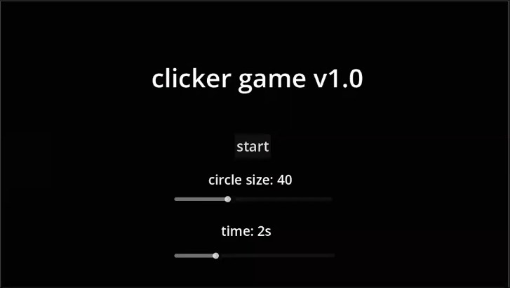
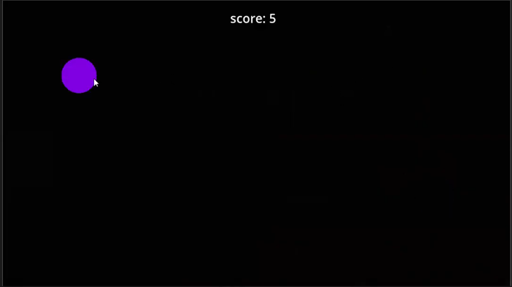
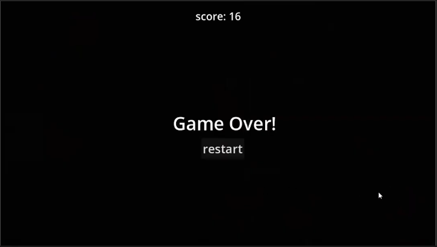

# musical clicker game
- name: Satya Fernandez
- Student Number: A00047588
- Class Group: A

# youtube video

# Screenshots

# Description

## Game mechanics
- a circle of one of 6 colours spawn with radius that the user entered and lasts for the time duration the user entered.
- everytime the circle is clicked , a note that corresponds to the colour is played at a random pitch along with an echo shortly after the first note.
- if the timer reaches the end without the circle being pressed , a missed signal is emitted and the game is over
- if the circle is pressed within the time duration , another circle is spawned and the process is repeated

## controls
- at the start menu , the user must select the size and duration of the circle which ultimately decides the difficulty of the game
- use the mouse or track pad to click on each circle
- overall a simplistic clicker game

# List of assets in the project
| asset | source |
|-------|--------|
| indo2.wav | [source](https://freesound.org/people/madjad/sounds/21663) |
| indo3.wav | [source](https://freesound.org/people/madjad/sounds/21661) |
| indo4.wav | [source](https://freesound.org/people/madjad/sounds/21640) |
| panio1.wav | [source](https://freesound.org/people/MGFaudio/sounds/634419) |
| piano2.wav | [source](https://freesound.org/people/MGFaudio/sounds/634413) |
| piano3.wav | [source](https://freesound.org/people/MGFaudio/sounds/634399) |
